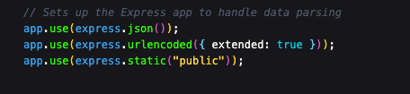
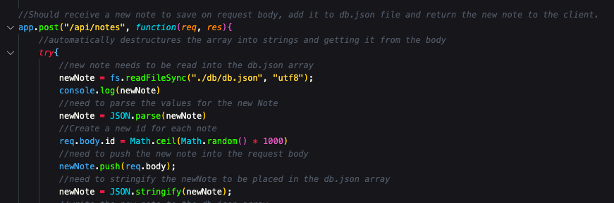
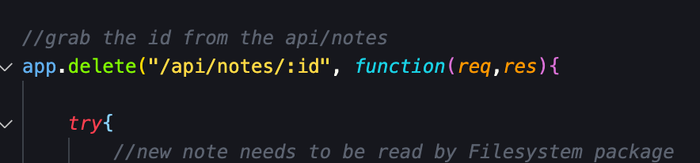

# express-note-taker

## Description
Create an application that can be used to write, save, and delete notes. This application will use an express backend and save and retrieve note data from a JSON file.

## App Demonstration
[Watch the video of this application in use here:](https://drive.google.com/file/d/1j6R8xwtBwSEffULArcixmTkYTeNBFEPA/view)

## Contents

* [db]- which houses the db.json array
* [public] - which contains the index.html, notes.html, and assets folder
    * [assets] - contain the index.js and styles.css files
* [package.json]
* [package-lock.json]
* [server.js] - which connects the back end of the application to the front end

## Application Requirements
These are referenced in the Submission Requirements section within [instructions.md](https://github.com/RFlanagan82/express-note-taker/blob/master/instructions.md)

## Usage Information
This application requires the following technologies and packages to work:

*[Node.Js] 
*[Express] 
*[FS] 
*[Path] 

To start, simply [visit](https://express-note-taker-rf.herokuapp.com/)

## Credits & Contributions
On 9-30-2020, tutor Andrew Hardemon helped me understand that I needed to add an essential line of middleware in order for my index.js file to be located and read. 

This is shown on line 17 on server.js...

On 10-1-2020, classmate Alex Flemming helped me correctly format my app.post route, specifically helping me undertand that the fs.writefile function needed to be inside the fs.readFileSync function. He took a different approach to assigning his note id, by attaching an increased index number to the note in the db.json array.

I used Math.ceil(Math.random() * 1000).

On 10-1-2020, classmate Brandon Walker helped me troubleshoot my app.delete function. We ultimately found my error where I didn't call the :id value within the "api/notes" parameter so the note could not be deleted because it was returning as a 404.

Once he helped me make the fix as shown here:

the application was able to connect the note to the right id and delete it.

## Resources
* [Shields.io](https://shields.io/category/license)
* [Markdown License Badges](https://gist.github.com/lukas-h/2a5d00690736b4c3a7ba)
* [Serving static files in Express](https://expressjs.com/en/starter/static-files.html#:~:text=To%20serve%20static%20files%20such,in%20middleware%20function%20in%20Express.&text=The%20root%20argument%20specifies%20the,which%20to%20serve%20static%20assets.)
* [Array.prototype.filter](https://developer.mozilla.org/en-US/docs/Web/JavaScript/Reference/Global_Objects/Array/filter)
* [Math.ceil()](https://developer.mozilla.org/en-US/docs/Web/JavaScript/Reference/Global_Objects/Math/ceil)
* [The Basics of Express Routes](https://modernweb.com/the-basics-of-express-routes/)
* [HTTP Request Methods](https://developer.mozilla.org/en-US/docs/Web/HTTP/Methods)

## Badge

## License
MIT Copyright 2020 - Ryan Flanagan

Permission is hereby granted, free of charge, to any person obtaining a copy of this software and associated documentation files (the "Software"), to deal in the Software without restriction, including without limitation the rights to use, copy, modify, merge, publish, distribute, sublicense, and/or sell copies of the Software, and to permit persons to whom the Software is furnished to do so, subject to the following conditions:

The above copyright notice and this permission notice shall be included in all copies or substantial portions of the Software.

THE SOFTWARE IS PROVIDED "AS IS", WITHOUT WARRANTY OF ANY KIND, EXPRESS OR IMPLIED, INCLUDING BUT NOT LIMITED TO THE WARRANTIES OF MERCHANTABILITY, FITNESS FOR A PARTICULAR PURPOSE AND NONINFRINGEMENT. IN NO EVENT SHALL THE AUTHORS OR COPYRIGHT HOLDERS BE LIABLE FOR ANY CLAIM, DAMAGES OR OTHER LIABILITY, WHETHER IN AN ACTION OF CONTRACT, TORT OR OTHERWISE, ARISING FROM, OUT OF OR IN CONNECTION WITH THE SOFTWARE OR THE USE OR OTHER DEALINGS IN THE SOFTWARE.